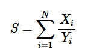

# Easy Fractions
### time limit per test2 seconds
### memory limit per test512 megabytes

Just a single line problem.   

You are given two sequences of positive integers, $X$ and $Y$, each of length $N$. Compute the sum:   
   
Express $S$ as a reduced fraction $\frac{p}{q}$, where $p$ and $q$ are coprime positive integers. Output  $p$ and $q$ modulo $998244353$.   

## Input

The first line contains an integer $N$. The next $N$ lines contain two integers $X_{i}$ and $Y_{i}$ respectively.   

## Output

Print the two integers $p$ and $q$ modulo $998244353$ in two lines.   

## Notes

$1\le N\le2\cdot10^5$   

$1\le X_{i},Y_{i}\le2\cdot10^5$   

$gcd(X_{i},Y_{i})=1$   
