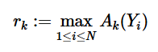
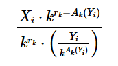
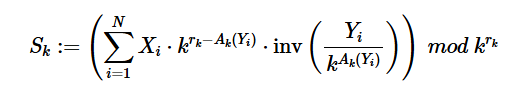

# Solution 
For a positive integer $n$ and a prime $k$, define $A_{k}(n)$ as the number of times $n$ is divisible by $k$ (also known as p-adic valuation of $n$). Since the common denominator will be a divisor of the product $\prod_{i=1}^{N}Y_{i}$, we can determine the final denominator by examining how each prime factor contributes to the denominators and then taking the product of the necessary powers of each prime. (Once q is determined, we can compute the numerator $p$ using values of $X_{i}$ and $q$.)
For a particular prime $k$, we want to know how many times $q$ is divisible by $k$. To do this, let's consider:   
   
Then the denominator becomes divisible by $k^{r_{k}}$.  Because we’re only interested in how many times the overall result is divisible by $k$, we can think of it as aligning all denominators to $k^{r_{k}}$. Therefore, using the modular inverse $inv(a)\ mod(k^{r_{k}})$ we only need to consider:   
   
Since the $k^{r_{k}}$ contributes to the denominator, we can consider the rest as part of numerator and applying modular inverse and summing over all fractions for a particular prime $k$:   
   
and analyse how many times $S_{k}$ is divisible by $k$, which can be taken care of by multiplying with modular inverse of this common factor in the last.    
